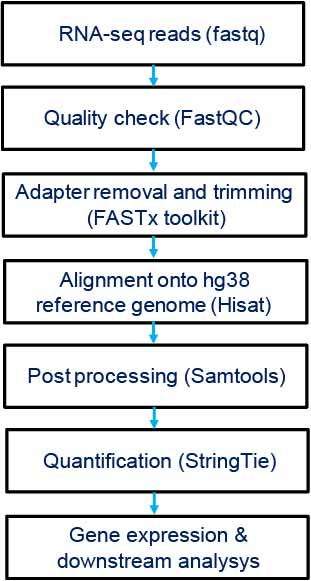

# Pipeline to analyse RNA sequencing data

## To investigate the complete transcriptome architecture of developing mouse eye.
I implemented this pipeline to investigate the complete transcriptome of developing mouse eye (lens and retina). 
In total, 35 RNA sequence data encompassing 7 developmental stages of lens and 11 developmental stages of retina
from publicly available wild-type mouse datasets were processed, aligned, quantified and analyzed with inhouse
RNA-Seq analysis pipeline and host total of >81,000 transcripts in the lens and >178,000
transcripts in the retina across all the included developmental stages. This study revealed the abundance of
novel transcripts and extensive splicing alterations (especially in lens) and illustrated that the extent of
novelty of expressed transcripts decreases significantly in post-natal lens compared to embryonic
stages. Several of the novel transcripts and splicing events were verified using RT-PCR.

Two articles were published using this pipeline:
1. Budak G, Dash S, **Srivastava R**, et al. Express: A database of transcriptome profiles encompassing known and novel
transcripts across multiple development stages in eye tissues Exp Eye Res. 2018 Mar;168:57-68.
2. **Srivastava R** et al. Transcriptome analysis of developing lens reveals abundance of novel transcripts and
extensive splicing alterations. Sci Rep. 2017 Sep 14;7(1):11572.

## The program "Pipeline_Fastq-to-Quant.py" is designed to generate script(s) as per the number of fastq files in a given directory.

User can customise the JobTemplate to use this script in any cluster depending on the requirements and modules available

#### Main steps in current pipeline are:

FASTQ ---> SAM ---> BAM ---> SORTED.BAM ---> Transcript_exp.gtf + Gene_exp.tab

## How to use?
#This code can work in Unix environment

	$python Pipeline_Fastq-to-Quant.py -h
	usage: Pipeline_Fastq-to-Quant.py [-h] [-file [fq [fq ...]]]
                                  [-modules [module [module ...]]] [-n N]
                                  [-p P] [-w W] [-index INDEX] [-gtf GTF]
                                  [-odir ODIR]

	Routine pipeline for RNA-seq fastq file processing and quant
	
	optional arguments:
	  -h, --help            show this help message and exit
	  -file [fq [fq ...]]   input fast(q|a) file(s) optional:path/*.fastq
				(default: None)
	  -modules [module [module ...]]
				module(s) required for data processing (default: None)
	  -n N                  number of nodes (default: 1)
	  -p P                  number of processors (default: 16)
	  -w W                  estimated wall time for process (default: 04:00:00)
	  -index INDEX          <path>/reference index file(s) (default:
				Reference/mouse/index/mm10*)
	  -gtf GTF              <path>/reference annotation file (default:
				Reference/mouse/mm10.gtf)
	  -odir ODIR            output directory path (default: )

## Regular steps involved in RNA-seq data processing

STEP A: Download the raw RNA sequencing data (FASTQ files) in local directory

STEP B: Analyse the quality and statistics of reads using FASTQC-toolkits. 

[Optional: The software should be installed in local machine or cluster and can be accesed by using following command]

	module load java/1.7.0_25
	module load fastqc/0.10.1
	fastqc -o /Out_Dir/ -f fastq /Sample.fastq
	#where Sample = fastq samples provided

STEP C: Do reads manipulation as per statistics for each FASTQ samples using FASTX-Toolkit 

[Optional: The software should be installed in local machine or cluster and can be accesed by using following command]:
		
	module load fastx/0.0.13 (in Karst)
	fastx_trimmer -Q 33 -f 3 -l 73 -i Sample.fastq -o Sample_T.fastq		
	#As an example - Here only 3rd (by -f) to 73rd (by -l) bases were kept.  

#In order to exclude the bases with low phred score, trimming of the reads was done. 
	
	fastq_quality_filter -Q 33 -q 30 -i Sample_T.fastq -o Sample_q30.fastq		
	#For instance - Here reads with average phred score <30 were filtered out

STEP D: Align the high quality sequencing reads (from STEP C) onto human reference genome (hg38)
using Hisat (installed? Must be Yes).
This step includes two sub-steps:
1. Building up the indexes for reference genome

		hisat-build -f /Human/Homo_sapiens.GRCh38.84.dna.toplevel.fa /Human/h38.84/h38.84
    
#Refernce genome (and .gtf file for annotation) for human was downloaded from Ensembl using following command:
		
		wget ftp://ftp.ensembl.org/pub/release-84/fasta/homo_sapiens/dna/Homo_sapiens.GRCh38.dna.toplevel.fa.gz
   	
	#NOTE: This step is required just once to index the genome build and can be used in next step directly	
	
2. Alignment:
	
		hisat -p 32 -q -x /Human/h38.84/h38.84 -1 Rep1_1.fastq -2 Rep1_2.fastq -S /Output/Rep1.sam

STEP E: Use samtools (check the module availability) for post processing of the aligned reads

		samtools view -bS /Output/Rep1.sam > /Output/Rep1.bam     # data compression
		samtools sort /Output/Rep1.bam /Output/Rep1.sorted        # sorting
		samtools index /Output/Rep1.sorted.bam                    # indexing the bam

STEP F: Quantification for processed reads using StringTie (Check for module availability)

		stringtie /Output/Rep1.sorted.bam -p 32 -G /Human/Homo_sapiens.GRCh38.84.gtf -o /Output/Rep1.gtf -A /Output/Rep1.tab
  		#.gtf file contains the quantified transcriptome .tab file provides the gene level expression
	
Note: This pipeline quantifies the annotated as well as novel genes (having prefix "STRG."). Flagging "e" in above command   
restrict the assembly to annotated genes/ transcripts

STEP G: Get the gene level expression of the samples in .tab files.
