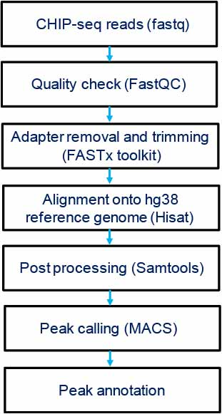

# Pipeline to analyse ChIP-seq data 
(From alignment to differential peak calling)

## Regulomics in multiple lineage of T-cells.
I implemented this pipeline to analyse ChIP seq data for p-300 and myc across multiple lineages of T cells (Th1, Th2, Th17
and Treg). I completed the bioinformatics analysis of this project in The Janga lab (https://jangalab.sitehost.iu.edu/), in collaboration with Dr. Mark Kaplan (https://medicine.iu.edu/faculty/906/kaplan-mark/). 
Our team has discovered an enhanced and highly conserved chip signal for p-300 at 6kb and 25 kb upstream of IL9 gene
in Th9 cells. In particular, an enhancer (CNS-25) in upstream of the Il9 gene was identified that binds most transcription factors (TFs) and promote Il9 gene expression. Our team has verified and characterized these signals as enhancer for 
IL9 gene in Th9 cells. This article was published in **Nature communications** in year 2018.

Koh B, Abdul Qayum A, **Srivastava R** et al. A conserved enhancer regulates Il9 expression in multiple lineages. Nature
Communications. 2018 Nov 15;9(1):4803.

**Figure 1:** Identification of a CNS-25 p300-binding element in the Il9 gene. Naive CD4+ T cells were isolated from C57BL/6 mice and cultured under the indicated Th cell polarizing conditions. On day 5, cells were harvested for ChIP analysis using p300 antibody. a ChIP-seq analysis of p300 in Th9 cells at the Il9 locus and comparison with ChIP-seq analysis of p300, H3K4me1, and STAT6 in Th2 cells (GSE22104 and GSE40463). Bottom, putative transcription factor-binding motifs in the most conserved regions of CNS-25. b Venn diagram indicating the overlap in Th9-enriched genes and p300-binding peaks in Th9 cells. c ChIP assay analysis of p300 at the CNS regions of the Il9 locus in Th cell subsets. Non-conserved sequences −12 and −35 kb were used as negative controls. Percent input depicted are the p300 ChIP values after subtraction of the control IgG ChIP values. d p300 and IgG ChIP values at the CNS-25 in Th9 cells. e p300 inhibitor added to Th9 cell cultures on day 3. On day 5, cells were harvested and restimulated with anti-CD3 overnight to assess IL-9 production using ELISA. Data are represented as mean ± SEM from three independent experiments (n = 3 or 4 per group). c One-way ANOVA with a post hoc Tukey test was used to generate p values for all multiple comparisons. **p < 0.01, ***p < 0.001. e A two-tailed Student’s t test was used for pairwise comparisons. **p < 0.01

# Major steps involved in data processing
STEP 1: Download the raw sequencing data (FASTQ files) in local directory

STEP 2: Analyse the quality and statistics of reads using FASTQC-toolkits. 
	[Option: Check for the software installed in cluster/ local machine]

	module load java/1.7.0_25   
	module load fastqc/0.10.1
	fastqc -o /Out_Dir/ -f fastq /Sample.fastq 	# where Sample = fastq samples provided

NOTE: Check if all the files provided were of good quality (Generally Phred score > 30)

STEP 3: Align the high quality sequencing reads (from STEP 3) onto human reference genome (hg38) using Hisat (pre installed in Bigred).
This step includes two sub-steps:

	module load hisat/0.1.6        # load module available in cluster/ local machine
	
   1. Building up the indexes for reference genome  
  	
	hisat-build -f /Mouse/Mus_musculus.GRCh38.84.dna.toplevel.fa /Mouse/m38.84/m38.84    
	#Refernce genome (and .gtf file for annotation) for mouse was downloaded from Ensembl
		
NOTE: This step is required just once to index the genome build and can be used in next step directly

   2. Alignment:
		
	hisat -p 32 -q -x /Mouse/m38.84/m38.84 -U Rep1.fastq /Output/Rep1.sam

STEP 4: Use samtools (check for module available in cluster/ local machine)
	for post processing of the aligned reads
	
	module load samtools/1.2 						# load module available in cluster
	samtools view -bS /Output/Rep1.sam > /Output/Rep1.bam			# data compression
	samtools cat -o /Output/Mel.bam /Output/Rep1.bam /Output/Rep2.bam	# data concatenation 
	samtools sort /Output/Mel.bam /Output/Mel.sorted	 		# sorting
	samtools index /Output/Mel.sorted.bam					# indexing the bam

STEP 5: Run MACS for ChIP seq data analysis and identification of differential binding by following command
	
	module load macs/1.4.2							# load module available in cluster
	cd ./MACS_Output/
	macs14 -t ./ALIGNMENT/CH12.sorted.bam -c ./ALIGNMENT/MEL.sorted.bam -f BAM -g mm -n MELvsCH12 -B -S  
	#Note: -c Control -t Treatment -f format -g organism -n name_study
