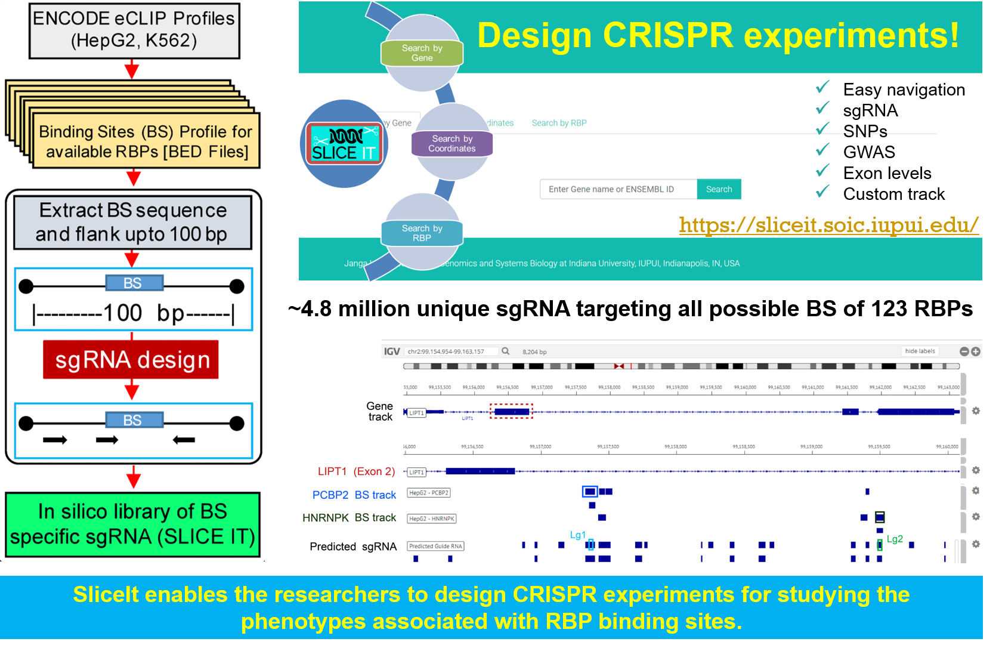

## SliceIt: A genome-wide resource and visualization tool to design CRISPR/Cas9 screens for editing protein-RNA interaction sites in the human genome.

**SliceIt** can be accessed by following the link:

https://sliceit.soic.iupui.edu/

The web interface for SliceIt was developed by Sasank Vemuri. 

Please see the source code here:
https://github.com/savemuri/SliceIt 

