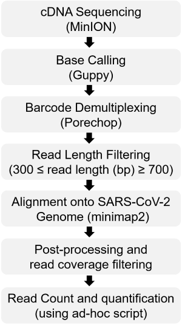

# Pipeline for sequence based detection of SARS-CoV2 virus

 

## Prerequisites:
Input: Nanopore sequencing data - signals stored in fast5 format 

Software: Install conda environment (latest version) following the instructions below:

https://docs.conda.io/projects/conda/en/latest/user-guide/install/linux.html

We thank the Artic team to provide guileline for setting up the artic framework (includes the conda environment) as described in below link:

https://artic.network/ncov-2019/ncov2019-it-setup.html

Install below sofware in conda environment as per instruction in respective links:

Porechop: https://github.com/rrwick/Porechop

minimap2: https://github.com/lh3/minimap2

## Data processing
**STEP 1:** Create output directories and sub directories (if required)

     mkdir basecalled porechopped nested_dir merge_chopped final_result
     for i in $(cat barcode_id.txt); do cd ./nested_dir|mkdir $i;done
     cd ..
     
**STEP 2:** Basecalling of nanopore sequencing signals (fast5)

Guppy basecalling with NO demultiplexing (it is recommended to have gpu support for **rapid** processing)

Optionally, live base calling can be done with in-built MinKnow software (demultiplexing OFF).

Cross check the kit and flowcell as per ONT manual instructions.
      
      /bin/guppy_basecaller -x "cuda:0" -i ./path/fast5/ -s ./basecalled/ --flowcell FLO-MIN106 --kit SQK-LSK109
      
**STEP 3:** Demultiplexing using Porechop (here we used stringent threshold as described in porechop homepage 

(https://github.com/rrwick/Porechop#barcode-demultiplexing)
      
      porechop -i ./basecalled/ -b ./porechopped/ --barcode_threshold 100 --require_two_barcodes
      for i in $(cat barcode_id.txt); do mv ./porechopped/$i.fastq ./nested_dir/$i/ ;done  
      
**STEP 4:** Read length filtering (to minimize chimeric read biases) followed by fastq merging:

(user can define the read quality and length filters criteria)
     
      source activate artic-ncov2019
      artic guppyplex --skip-quality-check --min-length 300 --max-length 700 --directory ./nested_dir/BC01/ --output ./merge_chopped/BC01.fastq
     
**STEP 5:** Alignment against SARS-Cov-2 reference genome with additional filtering:

a) query coverage (Query_Coverage >= 0.4)

b) gapped alignment(M/GM>=0.6) thresholding.

      for i in $(cat barcode_id.txt); do /path/minimap2/minimap2 -x map-ont --secondary=no -t 8 ./Refernce/nCoV-2019.reference.fasta ./merge_chopped/$i.fastq|awk '0.40 <=(($4-$3)/$2) && 0.60 <=($10/$11){print $0}' > ./final_result/$i.paf;done

**STEP 6:** Read count and quantification

      cd final_result
      wc -l *.paf|tr '.' ' '|awk '{print $2,$1}'|tr ' ' '\t'|grep -v "total" > Count.tab
      awk 'NR==FNR {sum+= $2; next}{printf("%0.3f\n", (($2*10^9)/(sum*29903)))}' Count.tab Count.tab > RPKM.tab
      paste Count.tab RPKM.tab > Quant_result.txt
      rm *.paf *.tab
